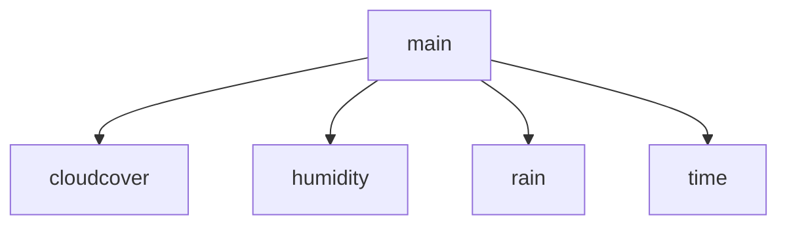

# Agodop
> Agodop is a simple Android weather app.

On the main screen, it shows:
  - Temperature
  - Humidity
  - Cloud coverage
  - Rain in mm

If you tap on any of these, it opens a new screen with data for the whole week for that specific item.
You can press the back button to return to the main screen.

## Rooting

## Additional info
Most of the project was done on discord call, so changes were commited by one person
